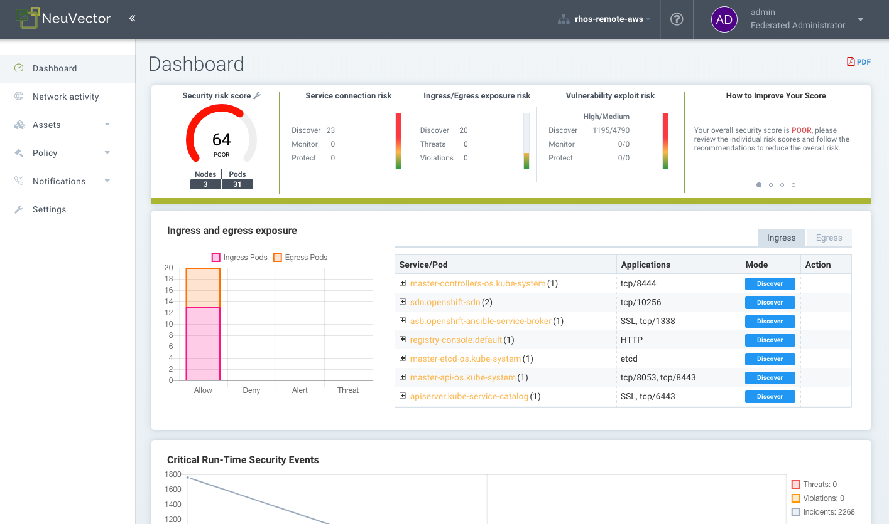
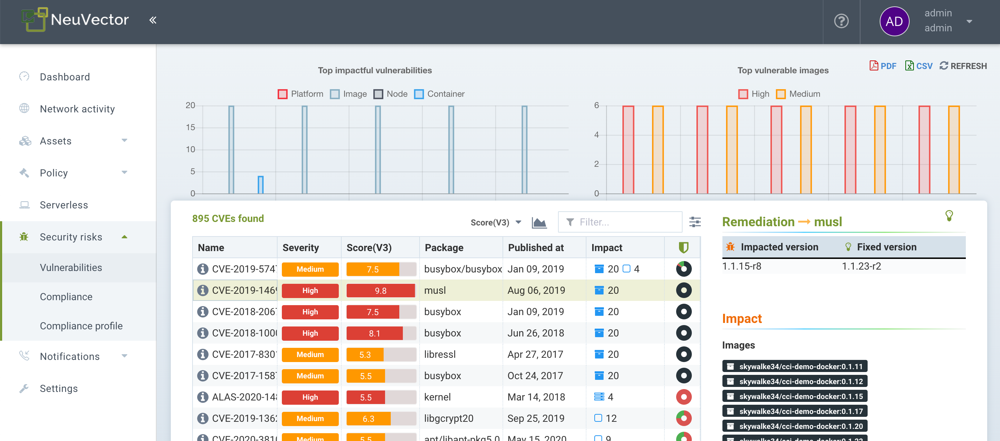
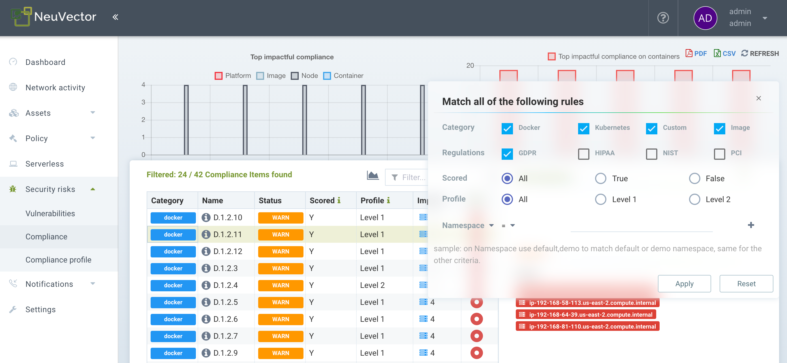
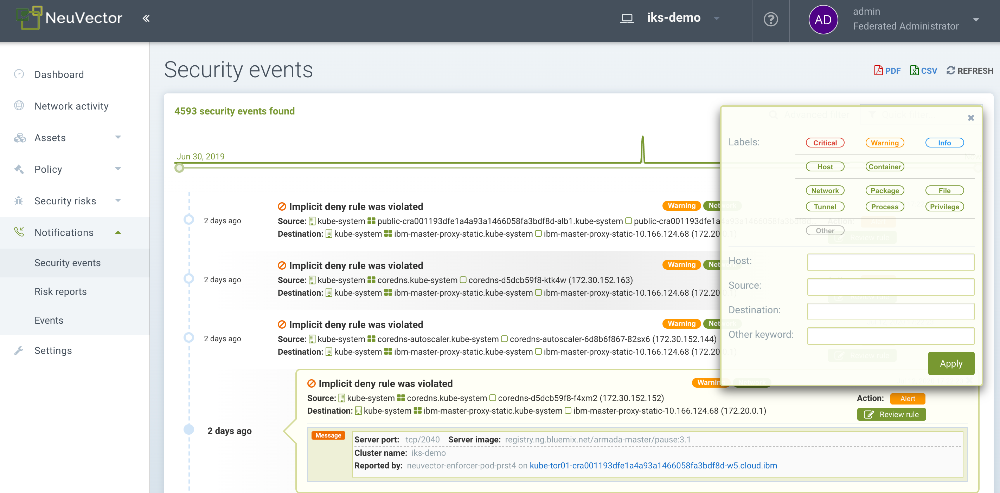
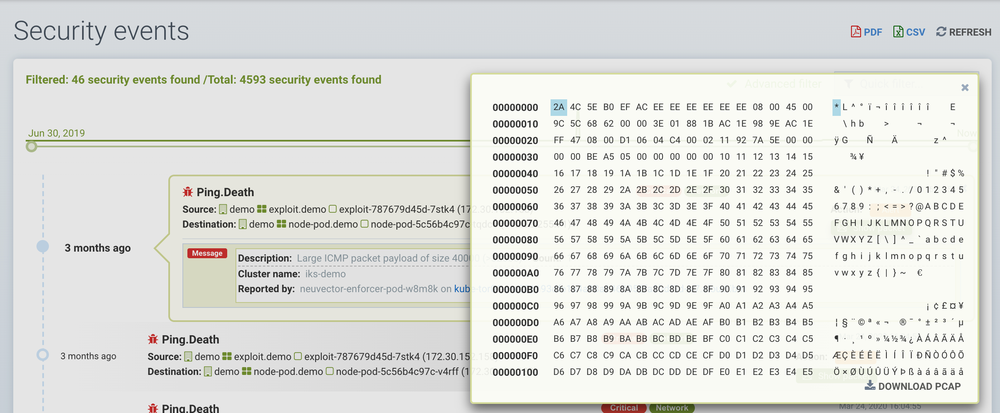
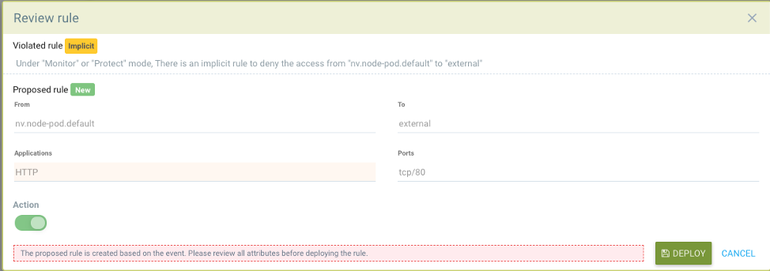

### Reporting 
Reports can be viewed and downloaded from several menus in the NeuVector console. The Dashboard displays a security summary which can be downloaded as a pdf. The pdf download can be filtered for a namespace if desired.



Vulnerability scanning and CIS benchmark results for registries, containers, nodes and platforms can also be downloaded as CSV files from their respective menus in the Assets menu sections. 

The Security Risks menu provides advanced correlation, filtering and reporting for vulnerabilities and compliance checks. Filtered views can be exported in CSV or PDF formats.



Compliance reports for PCI, HIPAA, GDPR and other regulations can be filtered, viewed and exported by selecting the regulation in the advanced filter popup in Security Risks -> Compliance.



####Event Reporting
All events such as security, admin, admission, scanning, and risk are logged by NeuVector and can be also viewed in the Console in the Notifications menu. See below for details.


<Strong>Event Limits</strong>

All events are stored in memory for display in the Dashboard and Notifications screens. It is expected that events are sent via SYSLOG, webhook or other means to be stored and managed by a SIEM system. There is currently a 4K limit on each event type below:
+ Risk Reports (scanning, found in Notifications -> Risk Reports)
+ General Events (administration, found in the Notifications -> Events)
+ Violations (network violations, found in Notifications -> Security Events)
+ Threats (network attacks and connection issues, found in Notifications -> Security Events)
+ Incidents (process and file violations, found in Notifications -> Security Events)

This is why once the limit is reached, only the most recent 4K events of that type are shown. This affects the Notifications lists are well as the displays in the Dashboard.

### SIEM and SYSLOG

You can configure the SYSLOG server and webhook notifications in the NeuVector console in the Settings -> Configuration menu. Choose the logging level, TCP or UDP, and format if json is desired.

You can then use your favorite reporting tools to monitor NeuVector events.

In addition, you can configure your syslog server through the CLI as follows:

```
> set system syslog_server <ip>[:port]
```

The REST API can also be used for configuration.


#### Sample SYSLOG Output

Network Violation
```
2020-01-24T21:39:34Z neuvector-controller-pod-575f94dccf-rccmt /usr/local/bin/controller 12 neuvector - notification=violation,level=Warning,reported_timestamp=1579901965,reported_at=2020-01-24T21:39:25Z,cluster_name=cluster.local,client_id=edf1c28d3411a9686e6e0374a9325b6a3626619938d3cf435a9d90075a1ef653,client_name=k8s_POD_node-pod-7c57bdbf5d-dxkn4_default_cdd9cf23-488d-439c-9408-ed98f838c67b_0,client_domain=default,client_image=k8s.gcr.io/pause:3.1,client_service=node-pod.default,server_id=external,server_name=external,server_port=80,ip_proto=6,applications=[HTTP],servers=[],sessions=1,policy_action=violate,policy_id=0,client_ip=192.168.35.69,server_ip=172.217.5.110
```

Process Violation
```
2020-01-24T21:39:29Z neuvector-controller-pod-575f94dccf-rccmt /usr/local/bin/controller 12 neuvector - notification=incident,name=Process.Profile.Violation,level=Warning,reported_timestamp=1579901965,reported_at=2020-01-24T21:39:25Z,cluster_name=cluster.local,host_id=k43:HF45:AJC6:5RYO:O5OA:KACD:KRT2:M3O6:P3VQ:IC4I:FSRD:P3HJ:ETLS,host_name=k43,enforcer_id=90822bad25eea14180c0942bf30197528bdab8c8237f307cc3059e6bbdb91f7a,enforcer_name=k8s_neuvector-enforcer-pod_neuvector-enforcer-pod-cg8jp_neuvector_d4ef187e-041c-4bc2-9cdc-c563a3feac6c_0,workload_id=d1be6d14f1f2782029d0944040ea8c0ba581991de99df86041205e15abc80209,workload_name=k8s_node-pod_node-pod-7c57bdbf5d-dxkn4_default_cdd9cf23-488d-439c-9408-ed98f838c67b_0,workload_domain=default,workload_image=nvbeta/node:latest,workload_service=node-pod.default,proc_name=curl,proc_path=/usr/bin/curl,proc_cmd=curl google.com,proc_effective_uid=1000,proc_effective_user=neuvector,client_ip=,server_ip=,client_port=0,server_port=0,server_conn_port=0,ether_type=0,ip_proto=0,conn_ingress=false,proc_parent_name=docker-runc,proc_parent_path=/usr/bin/docker-runc,action=violate,group=nv.node-pod.default,aggregation_from=1579901965,count=1,message=Process profile violation
```

Admission Control
```
2020-01-24T21:48:31Z neuvector-controller-pod-575f94dccf-rccmt /usr/local/bin/controller 12 neuvector - notification=audit,name=Admission.Control.Violation,level=Warning,reported_timestamp=1579902506,reported_at=2020-01-24T21:48:26Z,cluster_name=cluster.local,host_id=,host_name=,enforcer_id=,enforcer_name=,workload_domain=default,workload_image=nvbeta/swarm_nginx,base_os=,high_vul_cnt=0,medium_vul_cnt=0,cvedb_version=,message=Creation of Kubernetes ReplicaSet resource (nginx-pod-695cd4b87b) violates Admission Control deny rule id 1000 but is allowed in monitor mode [Notice: the requested image(s) are not scanned: nvbeta/swarm_nginx],user=kubernetes-admin,error=,aggregation_from=1579902506,count=1,platform=,platform_version=
```

To capture SYSLOG output:
```
nc -l -p 8514 -o syslog-dump.hex | tee syslog-messages.txt
```

Captures messages on screen, logs them to file and logs a hexdump.

#### Integration with Splunk
You can integrate with Splunk using SYSLOG to capture container security events and report in Splunk. 


### Notifications and Logs
In the NeuVector Console in the Notifications menu you can find notifications for Security Events, Risk (Scanning & Compliance) Events, and general system events.

Notifications can be downloaded as CSV or PDF from the Notifications menus. In addition, packet captures can be downloaded for network attacks, and vulnerability results can be downloaded from the Notifications -> Risk reports menu for each scan result.

You can also display the logs using the CLI or REST API.

#### Security Events

Violations are connections that violate the whitelist Rules or match a blacklist Rule. Network violations are captured and source IPs can be investigated further. Whitelist network  violation events show up as "Implicit Deny Rule is Violated" to indicate the network connection did not match any whitelist rule.



In this view, you can review network, process, and file events and easily add a whitelist rule for false positives by clicking the Review Rule button. The Advanced Filter enables you to select the type of event to display.


NeuVector also continuously monitors all containers for know attacks such as DNS, DDoS, HTTP-smuggling, tunneling etc. When an attack is detected it is logged here and blocked (if container/service is set to protect), and the packet is automatically captured. You can view the packet details, for example:



<strong>Add New Rules for Security Events</strong>

You can easily add rules (Security Policy) to allow or deny the detected event by selecting the Review Rule button and deploying a new rule. 



This is useful if false positives occur or a network/process behavior should have been discovered but did not occur during the Discover mode.

<strong>Advanced Filters</strong>

Create an advanced filter for viewing or exporting events by selecting each general type or entering keywords.
+ Network. Network events such as violations (implicit deny rules), threats.
+ Process. Process whitelist violations or suspicious processes detected such as NMAP, SSH etc.
+ Package. A package has been updated or installed in the container therefore this generated a security event.
+ Tunnel. A tunnel violation has been detected. Tunneling, typically dns tunneling is used to steal data. This detection is done by seeing a tunnel process start and correlating it with a network activity with dns protocol. See sample event below.  Description of iodine tunnel https://github.com/yarrick/iodine
+ File. File access violation. Either a monitored sensitive file/directory has been accessed (see list of default monitoring, or a custom file monitor rule has been triggered. https://docs.neuvector.com/policy/filerules
+ Privilege. A privilege escalation has been detected in container or host. Privilege escalations can be done in many ways and are not 100% detectable so this is a difficult condition to test.

#### Risk Reports
This section contains events for vulnerability scans (image, registry, run-time, container, host, platform), compliance scans (CIS benchmarks, custom scripts), and admission control events (allowed, denied).

### Other Integrations
NeuVector has published a Prometheus exporter with Grafana dashboard on the NeuVector github account https://github.com/neuvector/prometheus-exporter which can be customized for each installation.  In addition, sample integrations with Fluentd are also available upon request.

Webhook alerts can be sent by configuring the web hook endpoint in Settings -> Configuration. Then create the appropriate response rule(s) in the Policy -> Response rules menu to select the type of event and the webhook as the action.


