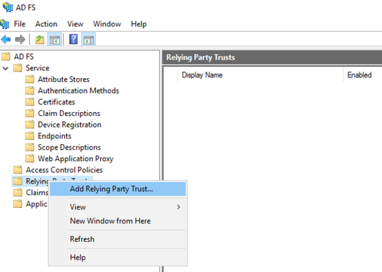
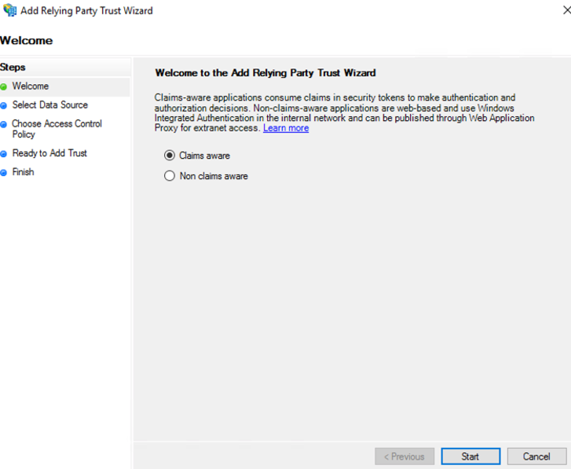
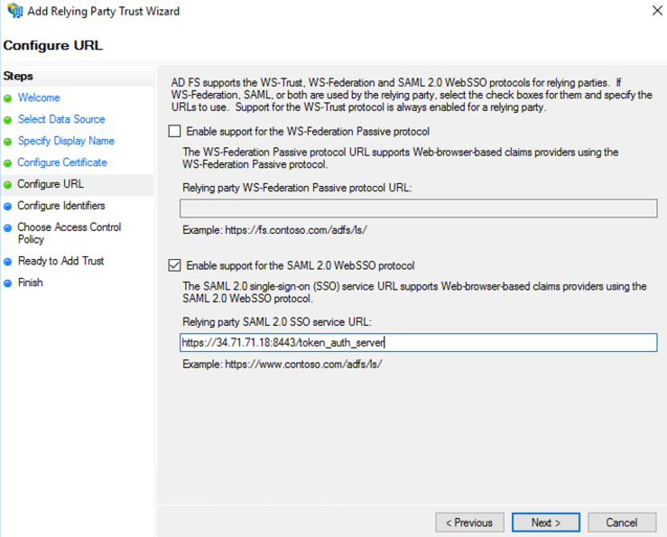
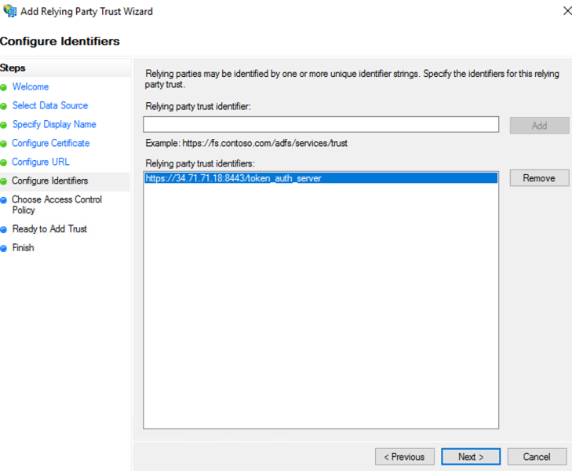
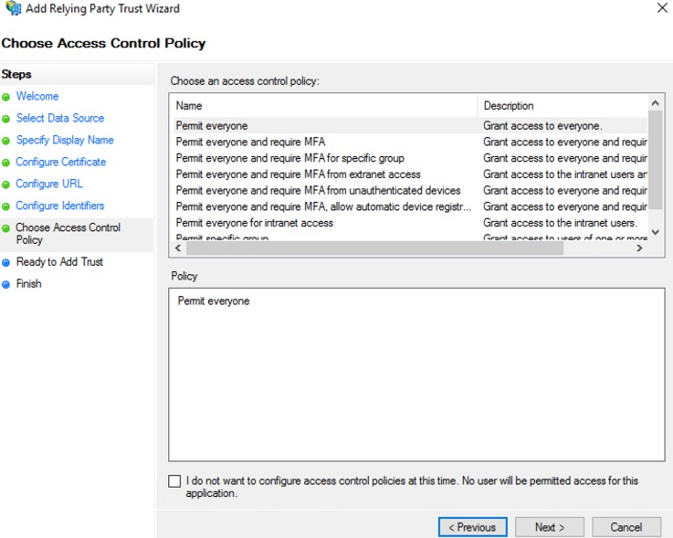
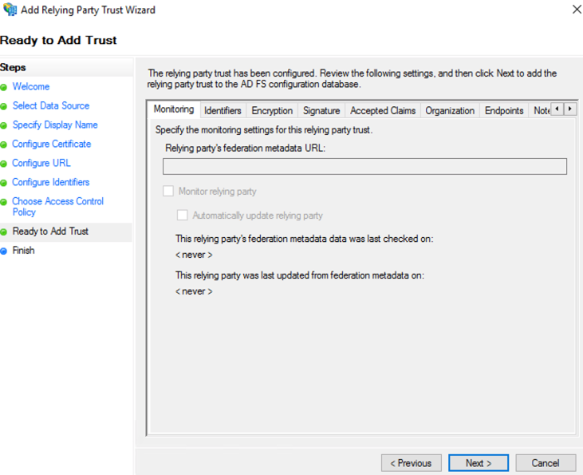
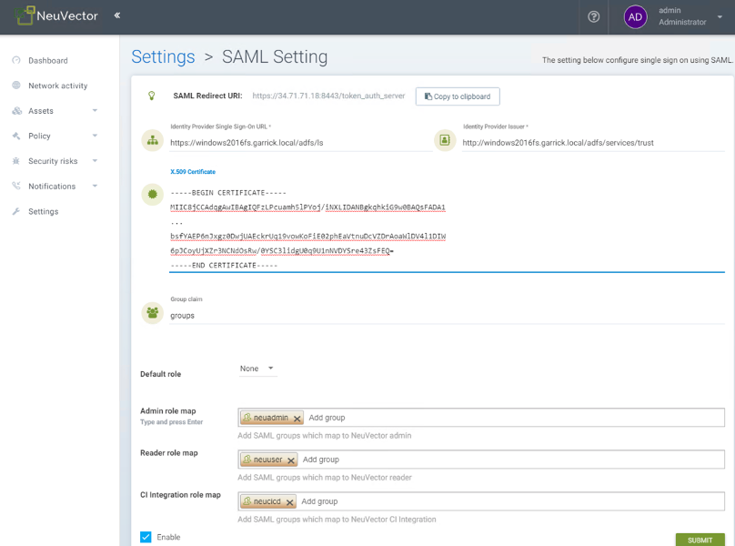

###Setting Up ADFS and NeuVector Integration
This section describes the setup steps in ADFS first, then in the NeuVector console.

####ADFS Setup

1.From AD FS Management, right click on “Relying Party Trusts” and select “Add Relying Party Trust…”.

2.Select “Start” button from Welcome step.

 
3.Select “Enter data about the relying party manually” and select “Next”.

4.Enter a unique name for Display name field and select “Next”.

5.Select “Next” to skip token encryption.

6.Check “Enable support for the SAML 2.0 WebSSO protocol” and enter  the SAML Redirect URI from NeuVector Settings>SAML Setting page into the “Relying party SAML 2.0 SSO service URL” field.  Select “Next” to continue.

7.Enter the same SAML Redirect URI into the “Relying party trust identifier” field and click “Add”; then select “Next” to continue.

8.Customize Access Control; then select “Next” to continue.

9.Select “Next” to continue.

10.Select “Close” to finish.

11.Select Edit Claim Issuance Policy…

12.Select “Add Rule…” and choose “Send LDAP Attributes as Claims”; then select “Next”.  Name the rule and choose Active Directory as the Attribute store. Only Username outgoing claim is required for authentication if default role is set; else groups is needed for role mapping.  Email is optional.
+ SAM-Account-Name -> Username
+ E-Mail-Address -> Email
+ Token-Groups – Unqalified Names -> groups

13.Select “Add Rule…” and choose “Transform an Incoming Claim”; then select “Next”.  Name the rule and set the field as captured in the screenshot below.  The Outgoing name ID format needs to be Transient Identifier.

  
####NeuVector Setup

1.Identify Provider Single Sign-On URL
+ View Endpoints from AD FS Management > Service and use “SAML 2.0/WS-Federation” endpoint URL.
+ Example: https://&lt;adfs-fqdn>/adfs/ls

2.Identity Provider Issuer
+ Right click on AD FS from AD FS Management console and select “Edit Federation Service Properties…”; use the “Federation Service identifier”.
+ Example: http://&lt;adfs-fqdn>/adfs/services/trust

3.X.509 Certificate
+ From AD FS Management, select Service > Certificate, right click on Token-signing certificate and choose “View Certificate…”
+ Select the Details tab and click “Copy to File”
+ Save it as a Base-64 encoded x.509 (.CER) file
+ Copy and paste the contents of the file into the X.509 Certificate field

4.Group claim
+ Enter the Outgoing claim name for the groups
+ Example: groups

5.Default role
+ Recommended to be “None” unless you want to allow any authenticated user a default role.

6.Role map
+ Set the group names of the users for the appropriate role.  (See screenshot example below.)

#### Mapping Groups to Roles and Namespaces
Please see the [Users and Roles](/configuration/users#mapping-groups-to-roles-and-namespaces) section for how to map groups to preset and custom roles as well as namespaces in NeuVector.

 
###Troubleshooting
1.ADFS SamlResponseSignature needs to be either MessageOnly or MessageAndAssertion.  Use Get-AdfsRelyingPartyTrust command to verify or update it.

 

