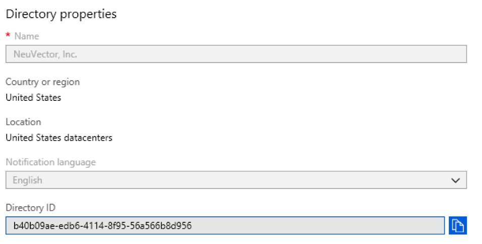
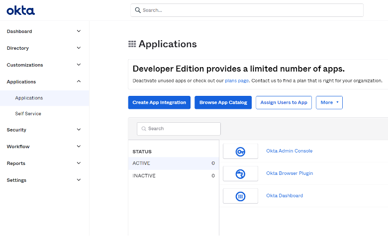
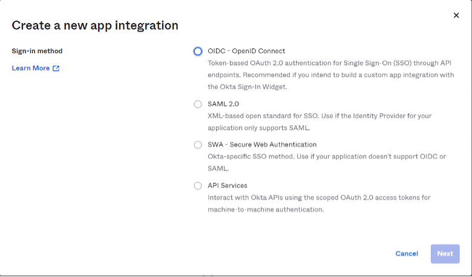
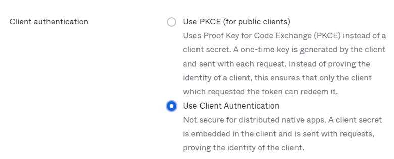
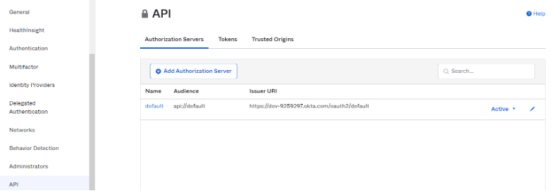

### Integrating with OpenID Connect (OIDC) for Azure and Okta

To enable OpenID Connect authentication, the **Issuer**, **Client ID** and **Client secret** settings are required. With the issuer URL, NeuVector will call the discovery API to retrieve the Authenorization, Token and User info endpoints.

Locate the OpenID Connect Redirect URI on the top of the NeuVector OpenID Connect Setting page. You will need copy this URI to the **Login redirect URIs** for Okta and **Reply URLs** for Microsoft Azure.

#### Microsoft Azure Configuration
In Azure Active Directory > App registrations > Application name > Settings Page, locate Application ID string. This is used to set the Client ID in NeuVector. The Client secret can be located in Azure's Keys setting.

The Issuer URL takes https://login.microsoftonline.com/{tenantID}/v2.0 format. To locate the tenantID, go to **Azure Active Directory > Properties Page** and found the Directory ID, replace it with the tenantID in the URL

If the users are assigned to the groups in the active directory, their group membership can be added to the claim. Find the application in **Azure Active Directory -> App registrations** and edit the manifest. Modify value of "groupMembershipClaims" to "Application Group".  There is a maximum number of groups that will get emitted into a token.  If the user belongs to a large number of groups ( > 200) and the value "All" is used, the token will not include the groups and authorization will failed.  Using the value "Application Group" instead of "All" will reduce the number of applicable groups returned in the token.  

By default, NeuVector looks for "groups" in the claim to identify the user's group membership. If other claim name is used, you can customize the claim name in NeuVector's OpenID Connect Setting page.

The group claim returned by Azure are identified by the "Object ID" instead of the name. The group's object ID can be located in **Azure Active Directory > Groups > Group name Page**. You should use this value to configure group-based role mapping in NeuVector -> Settings.

<strong>Verify Permissions</strong>

Make sure the following permissions have been set from Microsoft Graph
1. email - View users' email address
2. openid - Sign users in
3. profile - View users' basic profile

#### Okta Configuration

Login to your Okta account.

On the lefthand side menu, click “Applications -> Applications“ 
In the center pane, click “Create App Integration”:

A new pane will pop up to select the “Sign-in method”:

Select “OIDC – OpenID Connect” option.

A derived pane will appear, for “Application Type” selection:

Select “Native Application” option.

The central pane will now show the Native App Integration form where you have to fill in accordingly the following values:

For General Settings section:

App. Integration Name: Name for this integration. Freely choose any name
Grant Type (check):  
+ Authorization Code
+ Refresh Token
+ Resource Owner Password 
+ Implicit (hybrid) 

For Sign-in redirect URIs section:

Go to your NeuVector console and navigate to “Settings” -> “OpenId Connect Settings”.  At the top of the page, next to “OpenID Connect Redirect URI” label click “Copy to Clipboard”.

This will copy to the redirect URI to memory.
Paste it in its corresponding textbox:

For Assignments section:

Select “Allow everyone in your organization to access” to have this integration available for everyone in your org.

Then click the save button at the bottom of the page.

Once your general setting are saved, you will be taken to your new application integration setup and a client Id will be generated automatically.

In “Client Credentials” section, click edit and modify the “Client Authentication” section from “Use PKCE (for public clients)” to “Use Client Authentication”, and hit save. This will generate a new secret automatically which we will need in upcoming NeuVector setup steps:

Navigate to the “Sign On” tab and edit the “OpenID Connect ID Token” section:
Change the Issuer from 	“Dynamic (based on request domain)” to the fixed “Okta URL”:

The Okta console can operate in two modes, Classic Mode and Developer Mode.
In classic mode, the issuer URL is located at Okta Application page's Sign On Tab. To have the user's group membership returned in the claim, you need to add "groups" scope in the NeuVector OpenID Connect configuration page:

In the Developer Mode, Okta allows you to customize the claims. This is done in the API page by managing Authorization Servers (navigate to left hand menu -> Security -> API). The issuer URL is located in each authorization server's Settings tab:

Claims are name/value pairs that contain information about a user as well as meta-information about the OIDC service. 
In “OpenID Connect ID Token” section, you can create new claims for user's Groups and carry the claim in the ID Token (an ID Token is a JSON Web Token, a compact URL-Safe means of representing claims to be transferred between two parties, so identity information about the user is encoded right into the token and the token can be definitively verified to prove that is hasn’t been tampered with). If a specific scope is configured, make sure to add the scope to NeuVector OpenID Connect setting page, so that the claim can be included after the user is authenticated:

By default, NeuVector looks for "groups" in the claim to identify the user's group membership. If other claim name is used, you can customize the claim name in NeuVector's OpenID Connect Setting page. To configure claims, edit the “OpenID Connect ID Token” section as shown in the next image:

In your application integration page, navigate to “Assignments” tab and make sure you have the corresponding assignments listed:

#### NeuVector OpenID Connect Configuration

Configure the proper Issuer URL, Client ID and Client secret in the page.

After the user is authenticated, the proper role can be derived with group-based role mapping configuration. To setup group-based role mapping,

1. If group-based role mapping is not configured or the matched groups cannot be located, the authenticated user will be assigned with the Default role. If the Default role is set to None, when group-based role mapping fails, the user is not able to login.
2. Specify a list of groups respectively in Admin and Reader role map. The user's group membership is returned by the claims in the ID Token after the user is authenticated. If the matched group is located, the corresponding role will be assigned to the user.

The group can be mapped to the Admin role in NeuVector. Individual users can be 'promoted' to a Federated Admin role by logging in as a local cluster admin, selecting the user with Identify Provider 'OpenID', and editing their role in Settings -> Users/Roles.

#### Mapping Groups to Roles and Namespaces
Please see the [Users and Roles](/configuration/users#mapping-groups-to-roles-and-namespaces) section for how to map groups to preset and custom roles as well as namespaces in NeuVector.
